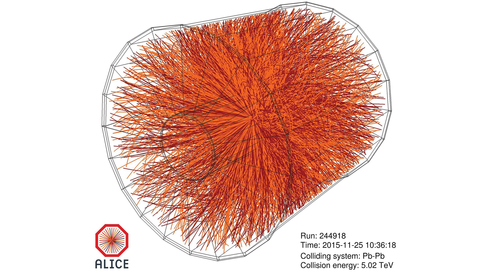

    

# Simulation

 

[This project](#simulation) show an approximated simulation of elementay particles colliding.\
The code I developed is used for physics course [Laboratorio di Elettromagnetismo e 
Ottica](https://www.unibo.it/it/didattica/insegnamenti/insegnamento/2022/434322) during 2022-2023 academic year.

## Download and usage

The project is written in [C++](https://isocpp.org/) language, and it is supported by 
[ROOT](https://root.cern.ch/) analysis framework. It can be compiled with [GCC](https://gcc.gnu.org/).

Please, read [this report](https://github.com/simop07/simulation_collisions/blob/main/PASQUINI_SIMONE_RELAZIONE_ROOT_2023.pdf) to know everything about the project.